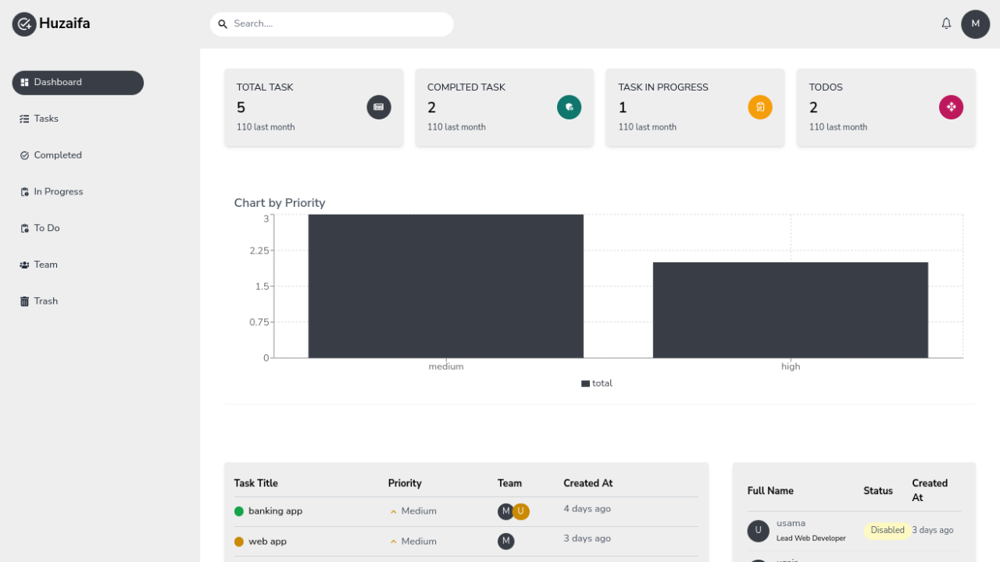

# Mern Stack Task Manager

## Features

- User registration with automatic password generation
- Copy password to clipboard after registration
- User login
- User roles and permissions 
- CRUD operations for tasks and subtasks
- Authentication and authorization using JWT
- Responsive design



## Tech Stack

- **Frontend**: React, Redux, TailwindCSS
- **Backend**: Node.js, Express.js
- **Database**: MongoDB
- **Authentication**: JWT, bcrypt.js
- **Other Libraries**: react-hook-form, Headless UI, sonner for notifications

## Installation

Follow these steps to set up the project locally.

### Prerequisites

- Node.js and npm installed on your machine
- MongoDB installed and running locally or access to a MongoDB Atlas cluster

### Clone the Repository

```bash
git clone https://github.com/huzaifa-mern-dev/mern-stack-task-manger.git
